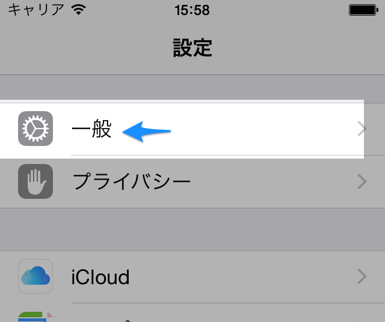
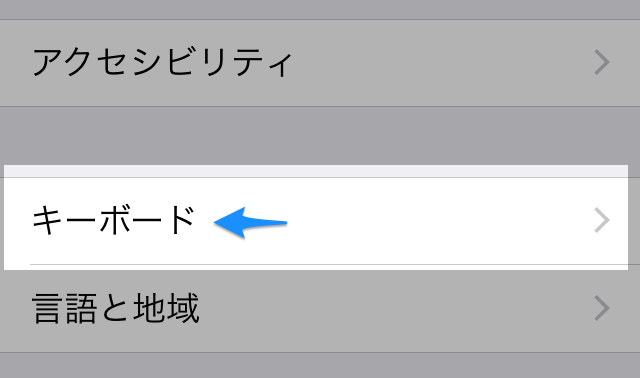
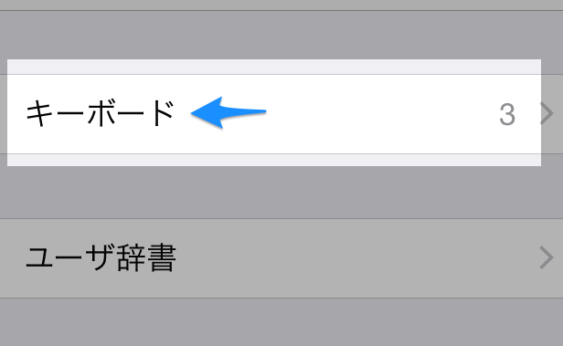
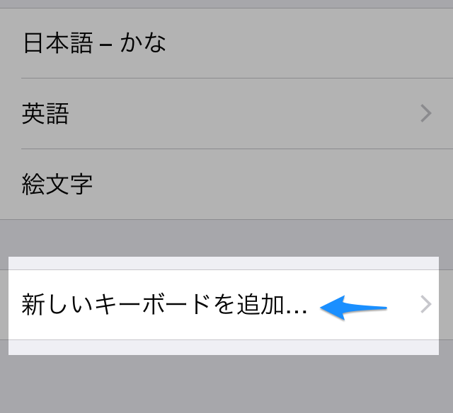
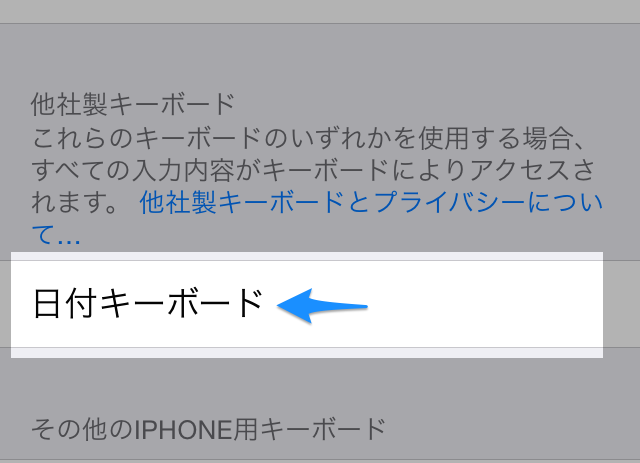
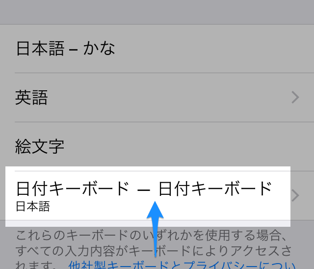
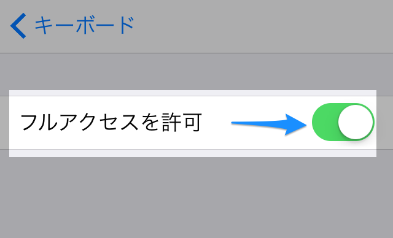
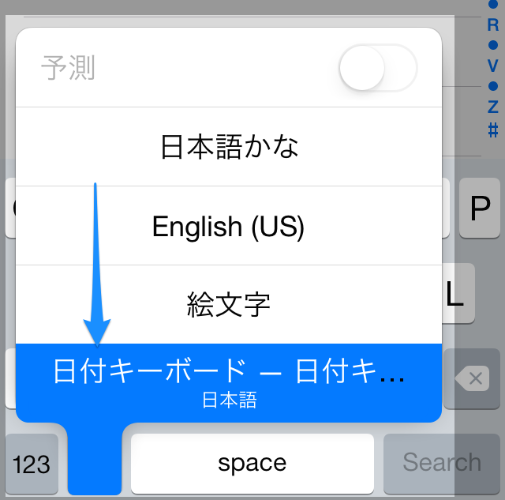

## キーボードの登録の仕方
(1) **日付キーボード**の追加

まず、**設定**アプリを開きます。

次に、**一般→キーボード→新しいキーボードを追加...**を開きます。

> 
→

→

→

キーボードの一覧が表示されるので、**日付キーボード**を選んでください。

> 

自動的に一つ前の画面に戻るので、新しく追加された**日付キーボード - 日付キーボード**を開いてください。

> 

**フルアクセスを許可**にチェックを入れてください。

**(フルアクセスを許可しない場合、キーボードを使用することができません。このキーボードは、あなたの入力したデータを収集するような行為は一切行いません。安心してフルアクセスを許可してください。)**

> 

これで、キーボード切り替え画面に**日付キーボード**が登録されました。

> 

**お疲れさまです！**
