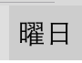
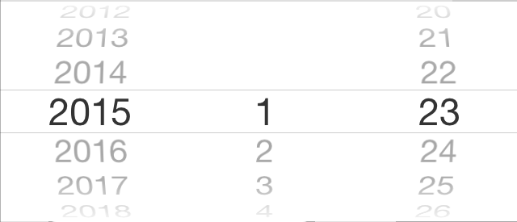
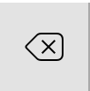

## 画面の説明

---

### プレビュー欄

入力される日付のプレビューが表示されています。ここで、自分の入力したい日付とあっているか、確認してください。

### 曜日ボタン

日付の末尾に、曜日を追加することができるボタンです。一度押すと、曜日が追加され、もう一度押すと曜日が削除されます。

### 日付ピッカー

ここから日付を選択することができます。日付を選択する際は、プレビュー画面と照らし合わせて、自分の選択した日付があっているか確認してください。

### 切り替えボタン

次のキーボードへ切り替えることができます。日付キーボードを使い終わったら、このボタンを押してください。

### 書式セレクター

入力する日付の書式を選択できます。**「1」**という項目は、数字を入力することができるキーボードを表示します。日付の微調整などにお使いください。

### 削除/取り消しボタン

通常は1文字づつ削除することができるボタンです。日付を入力した直後に限り、日付を丸ごと削除することができます。

### 確定ボタン

現在プレビュー欄に表示されている日付を、実際に入力するボタンです。最後に押してください。
